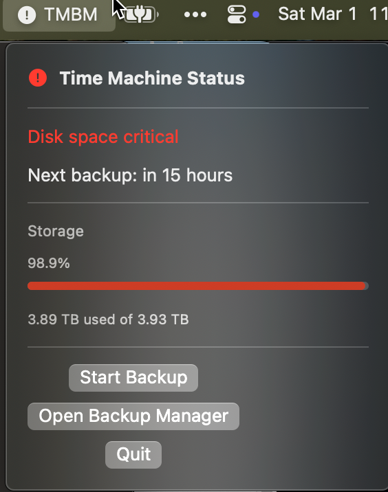
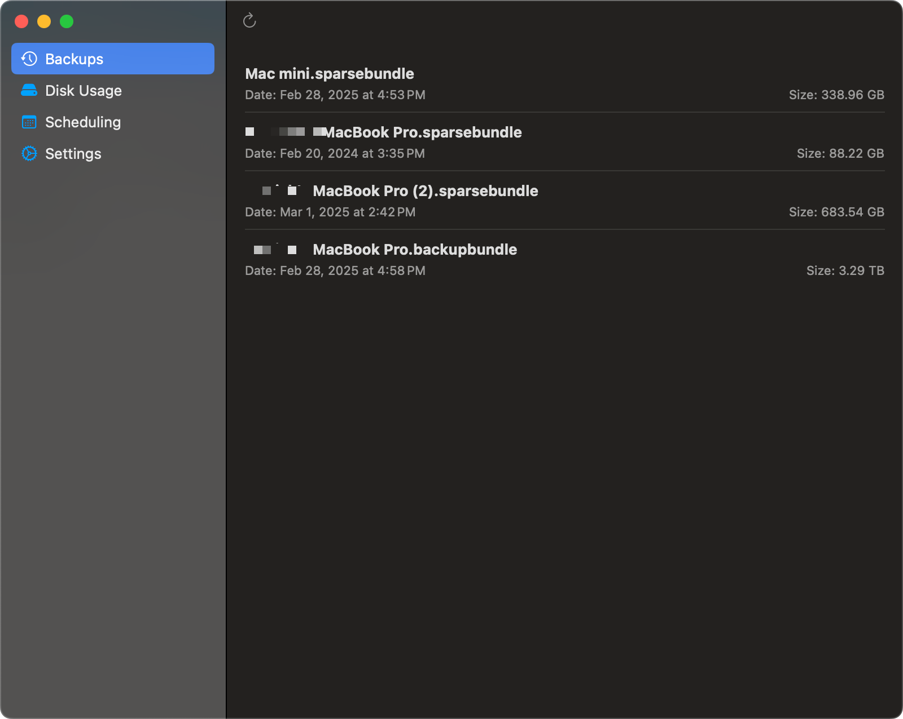
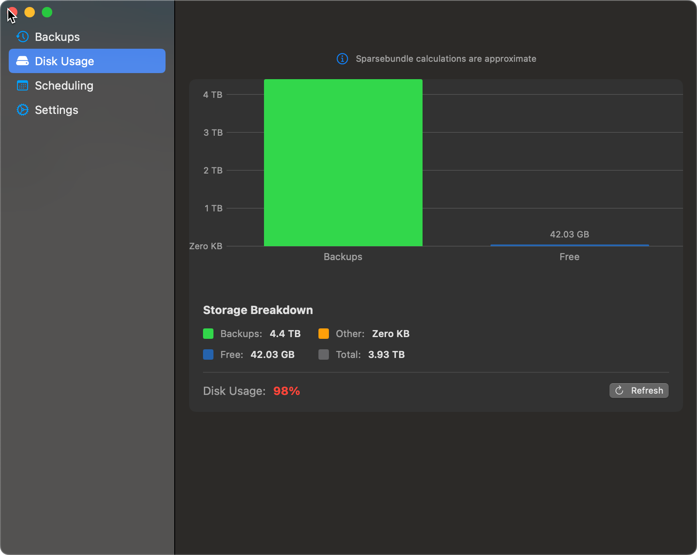
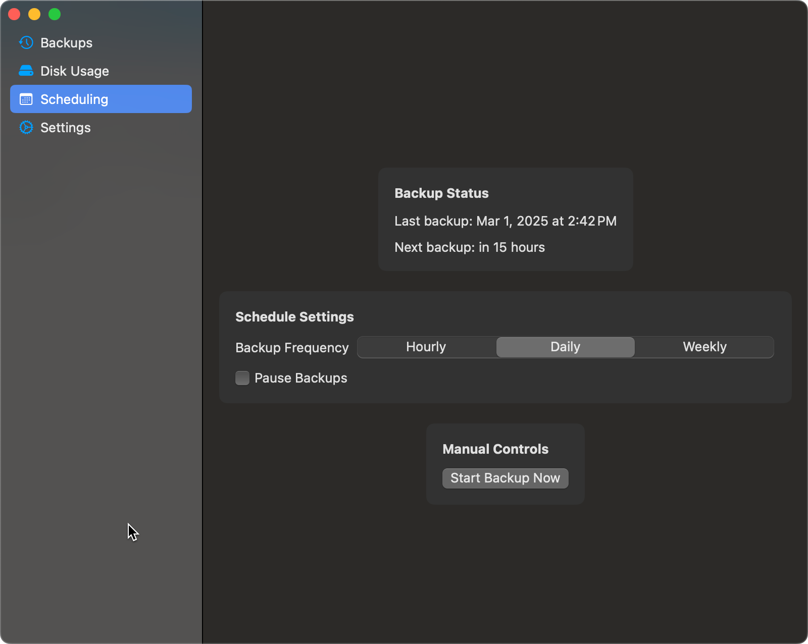
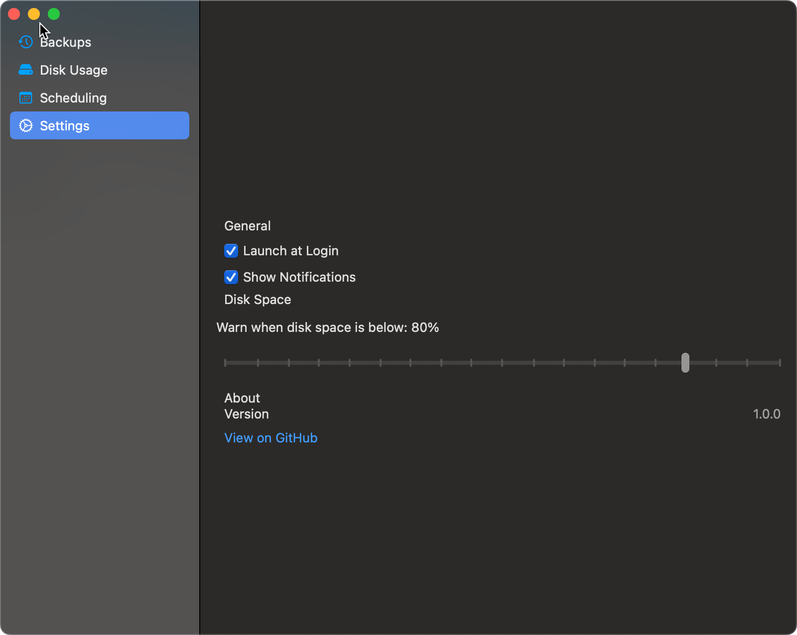

# TMBM - Time Machine Backup Manager

A macOS application for managing Time Machine backups.

## Overview

TMBM (Time Machine Backup Manager) is a lightweight, user-friendly macOS application that gives you greater control over your Time Machine backups. It sits in your menu bar, providing quick access to backup status, history, and controls without needing to open System Preferences.

Whether you want to monitor backup progress, schedule backups at specific times, or check disk usage, TMBM makes managing your Time Machine backups simpler and more efficient.

## Features

### Menu Bar Quick Access
Access all Time Machine functions directly from your menu bar. See backup status at a glance and control backups with a single click.



### Backup History and Status
View your backup history and current status in a clean, intuitive interface. Know exactly when your last backup completed and when the next one is scheduled.



### Disk Usage Monitoring
Monitor your backup disk usage with a visual representation of available space. Get alerts when your backup disk is running low on space.



### Custom Backup Scheduling
Set up custom backup schedules that work for you. Schedule backups for specific times or intervals to ensure your data is protected without disrupting your workflow.



### Backup Destination Management
Easily manage and switch between multiple backup destinations. Add, remove, or select different backup drives with a simple interface.



## Development

### Prerequisites

- macOS 10.15 or later
- Xcode 12.0 or later
- Swift 5.3 or later

### Building the App

To build the app, run the build script:

```bash
./scripts/build_app_bundle.sh
```

This will create the app bundle in the `build` directory. You can then open the app with:

```bash
open build/TMBMApp.app
```

### Project Maintenance

#### Cleanup

To clean up temporary files and directories, run the cleanup script:

```bash
./scripts/cleanup.sh
```

This script will:
- Remove the `.backup` directory
- Remove the `build-logs` directory
- Clean the `build` directory (keeping the app but removing other files)
- Remove Xcode user data
- Remove macOS system files
- Remove vim swap files
- Remove other temporary files

### Project Structure

- `App/` - The main application code
  - `Sources/` - Swift source files
    - `ViewModels/` - View models
    - `Views/` - SwiftUI views
  - `Resources/` - Assets and resources
- `CorePackage/` - The core functionality as a Swift Package
  - `Sources/TMBM/` - Core functionality
    - `Models/` - Data models
    - `Services/` - Services for interacting with Time Machine
  - `Tests/` - Unit tests
- `scripts/` - Build and utility scripts
- `documentation/` - Project documentation

## License

This project is licensed under the MIT License - see the LICENSE file for details.

## Contact

For questions or feedback, please open an issue on the project repository. 